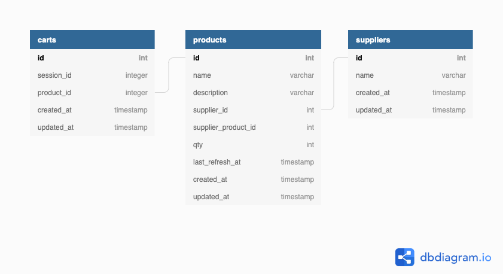

# Pour commencer

Bonjour 👋🏻

Nous sommes heureux de te savoir intéressé à vouloir travailler avec nous. Ces trois tâches te permettront de nous démontrer tes compétences en programmation, et en analyse des besoins.

Nous souhaitons voir comment tu vas réagir avec des outils et languages de programmation que tu ne maitrises pas. Il est tout à fait approprié de faire du copier/coller de codes trouvés sur internet. Signale nous simplement dans un commentaire les liens des sources utilisées.

Pour ces trois challenges, nous allons évaluer la clarté du code, les résultats aux problèmes (est-ce que les solutions proposées résolvent les problèmes), la facilité de la solution proposée ainsi que la documentation.

Merci d'envoyer les fichiers sources dans un fichier compressé par courriel ou partager le lien d'un dépôt Github. Après avoir terminé cet exercice, nous planifierons une rencontre afin d'échanger autour de la solution proposée et te partager nos retours.

Bonne chance à toi.

Jean-Baptiste Fournot

# Le projet

Aujourd'hui, tu vas avoir la chance de travailler sur l'application de gestion des produits de notre client CBS: Canadian Bicycle Supply. Les utilisateurs peuvent passer des commandes de produits, et une API REST est disponible pour la gestion des produits: [`http://127.0.0.1:8000/products`](http://127.0.0.1:8000/products).

Voici le modèle relationnel de la base de données de l'application.



## Installation

Pour installer cette application, `php` et `composer` doivent etre installés sur la machine. Lancer la commande `composer install` pour télécharger les dépendances du projet puis executer la commande `php artisan serve` pour démarrer le serveur de développement de Laravel.

## Tâche 1: Rapport des produits expirés par fournisseur

On souhaite modifier le rapport de la liste des produits expirés, c'est à dire, dont le champ `last_refresh_at` est plus grand de 1 mois, regroupés par fournisseur. 
Le rapport est déjà disponible [`http://127.0.0.1:8000`](https://127.0.0.1:8000) mais il ne fonctionne pas correctement.

Il faut donc ajuster le fichier [`ReportingController`](app/Http/Controllers/ReportingController.php) en ajoutant le scope `expired` à la requête des produits. Le scope `expired` doit être créé dans le fichier [`Product`](app/Models/Product.php).

Les variables `$products` et `$suppliers` sont des collections. [Consulter la documentation](https://laravel.com/docs/5.8/collections) pour en apprendre plus sur les collections et regrouper les produits par fournisseur.

Ajuster l'affichage du rapport en modifiant la vue [`productsExpiredReport.blade.php`](resources/views/reports/productsExpiredReport.blade.php) et afficher sous la forme suivante:

```
FOURNISSEUR 1: LISTE DES PRODUITS EXPIRÉS
- Nom du produit 1: quantité, date d'expiration
- Nom du produit 2: quantité, date d'expiration
- Nom du produit 3: quantité, date d'expiration

FOURNISSEUR 2: LISTE DES PRODUITS EXPIRÉS
- Nom du produit 1: quantité, date d'expiration
- Nom du produit 2: quantité, date d'expiration
- Nom du produit 3: quantité, date d'expiration
```

## Tâche 2: Calcul du stock réel des produits

Le champ `qty` de la table `products` (voir modèle relationnel plus haut) ne prend pas en compte les produits ajoutés au panier par les utilisateurs (table `carts`). On souhaite donc calculer l'inventaire réel disponible et afficher cette information dans un nouvel attribut du modèle [`Product`](app/Models/Product.php) que l'on appellera `qty_available`. Il faudra également afficher ce nouveau champ dans les résultats de l'API REST en modifiant le fichier [`ProductRessource`](app/Http/Resources/Product.php).

Pour créer un nouvel attribut à un model, consulter [cette page de la documentation](https://laravel.com/docs/5.7/eloquent-mutators#defining-an-accessor). Pour calculer l'inventaire réel, il faut créer une relation entre les tables `products` et `carts`. Deux possibilités: utiliser [Eloquent relationships](https://laravel.com/docs/5.7/eloquent-relationships) ou [ajouter une relation join dans un scope du modèle](https://laravel.com/docs/5.7/eloquent#query-scopes) `Product`.

Ne pas oublier d'ajouter le champ `qty_available` dans les résultats de l'API en modifiant le fichier [ProductRessource](app/Http/Resources/Product.php).

## Tâche 3: Import des produits depuis 

Le client souhaite pouvoir importer manuellement des listes de produits fournies par ses fournisseurs dans son application de gestion. Les trois listes à importer sont localisées dans le dossier [`suppliers-data`](/suppliers-data). Le client vous fait remarquer que la structure des tableaux est différente pour chaque fournisseur, et **qu'il faut ajouter dans la base de données le nouveau fournisseur SGO**.

Le client souhaite pouvoir téléverser ses listes dans le système à chaque début de mois plutôt que  de rentrer manuellement les informations. Les listes contiennent des produits nouveaux et d'autres, déjà enregistrés dans le système mais qu'on souhaiterait mettre à jour. On souhaite surtout mettre à jour le champ `qty` de notre base de données selon les inventaires de nos fournisseurs. 

La base de données de l'application est de type SQLITE et est disponible dans le dossier [`database.sqlite`](/database/database.sqlite). Une API REST est aussi disponible pour lire, écrire, mettre à jour et supprimer des produits.

| Method      | URI           
| ----------- |:---------------------------------:
| GET         | application.dev/products
| POST        | application.dev/products
| GET         | application.dev/products/{product}
| PUT, PATCH  | application.dev/products/{product}
| DELETE      | application.dev/products/{product}

### Objectif

Développer une solution pour importer des fichiers excels fournis par des fournisseurs. La procédure d'importation doit être simple, et fonctionner sur les environnements PC et MAC. Aucune technologie imposée pour cet exercice, mais la solution doit être simple pour le client et une documentation sommaire pour installer et faire fonctionner la solution est requise.

Le client souhaite également dans le futur pouvoir ajouter facilement de nouveaux fichiers de fournisseurs en minimisant les coûts.

